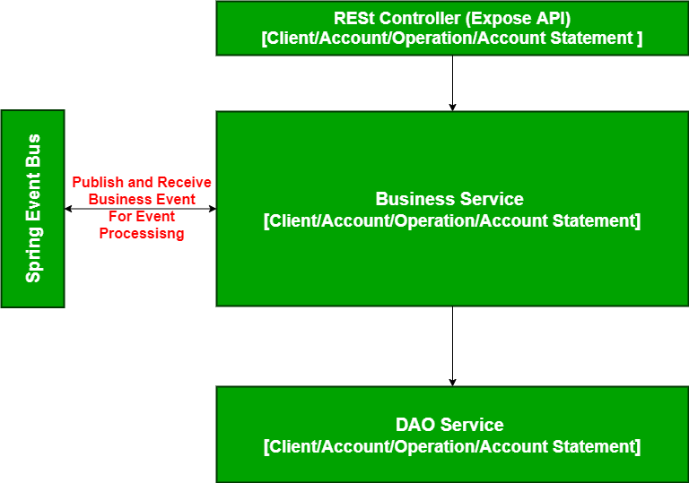

# kata-bank-account-sg
Bank Account Kata For SG

# Design

# To Build

* Clone project `git clone git@github.com:jetune/kata-bank-account-sg.git`
* Go to the Project directory `cd kata-bank-account-sg`
* Build the project `mvn clean install` or `. mvnw clean install`

# To Run Service

* Start the Project `mvn spring-boot:run`

# Usage

* Import Postman Collection in project Root dir and enjoy all Endpoints (`bank-account-kata-sg.postman_collection.json`)
